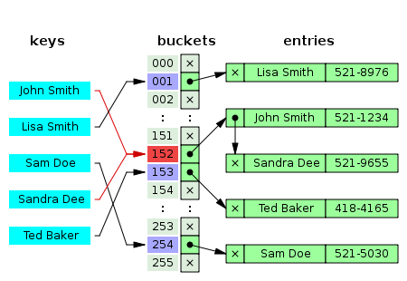

# Hash Table
맵, 딕션너리로도 불린다.
자바스크립트에서 JSON을 사용하면 키와 값으로 이뤄진 쌍을 표현할 수 있다.

아래 그림 처럼 같은 키와 매칭되는 index 값이 중복 되지 않으면 문제가 되지 않는다.

하지만 아래처럼 충돌 나는 경우 각 값이 있는  buckets 값에 linked list를 참조하여 가지게 한다.

여기에서는 충돌을 해결한 방식으로 구현해 본다.

## Performance
 Algrothm | Average | Worst case
----------|---------|----------- 
Space	  |   O(n)	|   O(n)
Search	  |	  O(1)	|   O(n)
Insert	  |	  O(1)	|   O(n)
Delete	  |	  O(1)	|   O(n)