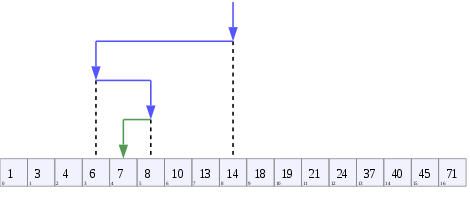

# 이진탐색(binary search)

이진탐색은 정렬된 데이터에 특정 값이 있는지 여부를 검색할때 사용할 수 있다.

정렬된 배열이 있다고 했을때, 다음 순서로 탐색하게 된다.

- 전체 배열의 중간 위치의 값을 기준으로 삼는다.
- 중간 값보다 찾아야 할 값이 같다면 찾았으므로 반환 한다.  
  - 중간 값보다 찾아야 할 값이 작다면 중간 값을 기준으로 오른쪽에 있을수 없기 때문에 right 위치를 중간값 -1 한 값으로 옮긴다.  
  - 중간 값 보다 찾아야 할 값이 크다면 중간 값을 기준으로 왼쪽에 있을수 없기 때문에 left 위치를 중간값 +1 한 값으로 바꾼다.
- left, right 좌표를 바꾼 후 다시 첫번째 과정을 되풀이 한다.
  - 단 left와 right가 같거나 넘어가게 되면 무의미 하므로 중단 한다.

앞서 설명한 포인터를 옮기는 방식으로 구현한 코드가 [이 링크](./index.js)이고 재귀(recursive)로 해결한 방법이 [이 링크](./use_recursive.js)있다.  

## Performance

Best case | Average | Worst case 
--------- | -------- | ---------
O(1) | O(log n) | O(log n)

## Reference
- [Wikipedia](https://en.wikipedia.org/wiki/Binary_search_algorithm)
